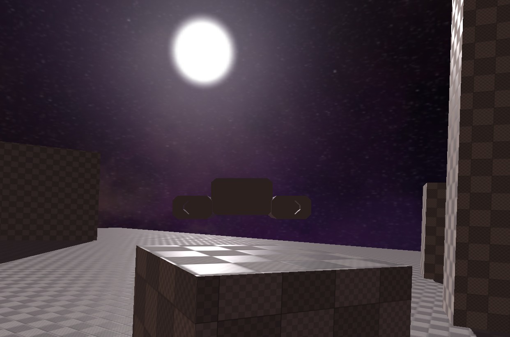

# Space Ship Controller

A space ship controller with airplane-like physics. Documentation is in the `ship_controller.gd` script.

## Usage

Copy the contents of the addons folder into the addons folder of your project.

Without Godot open, copy the `[input]` section out of the demo's `project.godot` to add keybindings to the necessary actions.

Set the gravity of the project to 0.

Then instance the `ship_controller.tscn` scene and add a mesh and collision shapes to it. The properties are explained in the script.
